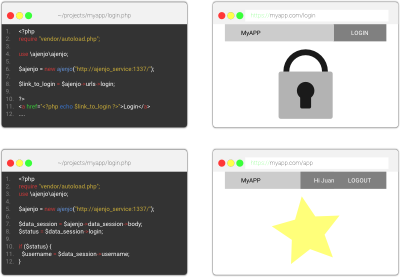

Ajenjo Service 
==============

> **Nuestra mision es hacer las cesiones censillas.**

Es un software de código abierto que permite un control de sesiones descentralizada al sistema basado en usuarios, grupos y permisos.

Protegiendo los distintos servicios del sistema que incluya a Ajenjo Service basado en la integración con las políticas de software durante la fase de desarrollo.

Versiones
---------

### Versión 0.1.0 Beta

Desarrolladores
---------------

Ayuda en el codigo fuente ingresando a [ajenjo/backend-definition](https://github.com/ajenjo/backend-definition).

Soporte para otras plataformas
------------------------------

Visita los complementos compatibles con:

 - [PHP](https://github.com/ajenjo/ajenjo-php)

Comunidad
---------

Ayuda y contribuye a este proyecto en:

 - Gitter 

Prensa
------

Nos gusta usar el isotipo , para dar a conocer
este software al mundo.

[Leer más.](press/README.md)

