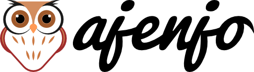
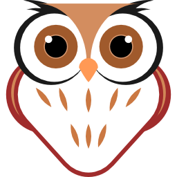
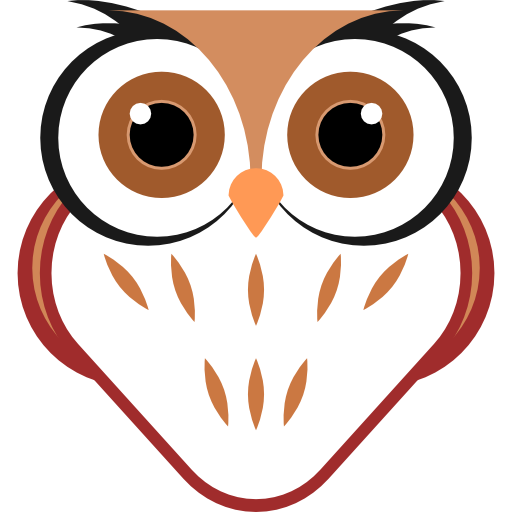

Imagen Ajenjo
=============

Esta es la imagen oficial del proyecto ajenjo. la cual esta libre de
distribución, publicación y bajo la [licencia Creative Commons](#licencia).

Imagen Vectorizada
------------------

Nos gusta usar imágenes vectorizadas para poder trabajar con una imagen mas
clara y responsiva en nuestros sitios.

Tenemos disponible la imagen en vector [logo ajenjo.svg](logo%20ajenjo.svg) de
la imagen de Ajenjo.

Recomendamos usar [Inkscape](https://inkscape.org/) para trabajar con el formato
SVG.

Algunas Medidas Disponibles Para el Imagotipo
---------------------------------------------

   (Imagotipo Medida 64 x 18)

 (Imagotipo Medida 128 x 36)

 (Imagotipo Medida 256 x 72)

 (Imagotipo Medida 512 x 145)

Algunas Medidas Disponibles Para el Isotipo
-------------------------------------------

   (Isotipo Medida 32 x 32)

   (Isotipo Medida 64 x 64)

 (Isotipo Medida 128 x 128)

 (Isotipo Medida 256 x 256)

 (Isotipo Medida 512 x 512)

Licencia
--------

Esta obra está bajo una [Licencia Creative Commons Atribución-CompartirIgual 4.0 Unported](http://creativecommons.org/licenses/by-sa/4.0/).

<http://creativecommons.org/licenses/by-sa/3.0/>

